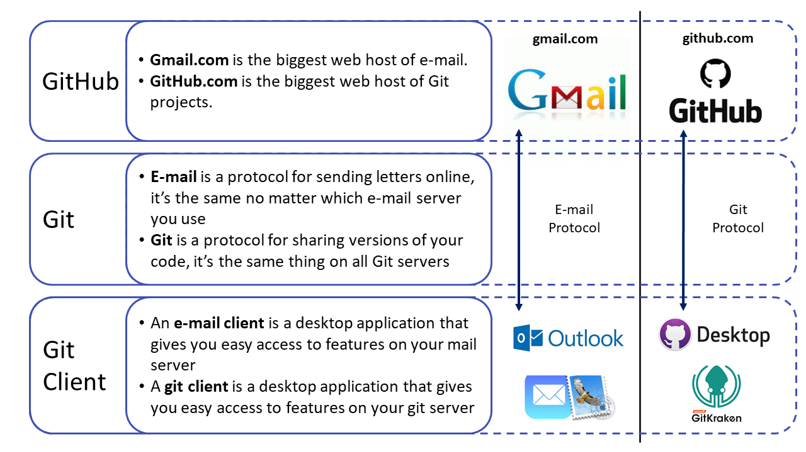

# Git and GitHub

If you want to be invited as a collaborator on a World Bank hosted repository or attend our _GitHub for Beginners_ training, then you need the following two things in the list below. If you want to know what either of these two things are, please read the rest of this page.

1. You need a GitHub.com account. If you do not already have one, create a free account [here](https://github.com/join). After you have done so, send your username to the team with the repository you want to be invited to as a collaborator, or send it to the person organizing the beginner training you intend to attend.
2. You need to install a Git "client" on your computer. There are many clients to choose from and almost all of them are free. Which one you choose does not matter from a technical perspective, but in the beginner training we will show how to do things using the client [GitHub Desktop](https://desktop.github.com) which is free to use. If you already now know that you intend to use Git extensively, please read the section on Git clients below.

If you are a World Bank employee and either want to access the features in the World Bank's paid enterprise account (we recommend you do so), or if you want to create your own repository within the World Bank's account, see the [World Bank GitHub Group](#wbg-github) section below.

If you are helping to organize a Git training with DIME Analytics, see [this checklist](#checklist-for-intro-to-git-and-github-training).

## What is Git and what is needed to use Git?
Git is a tool that solves almost any code collaboration challenge you can think of. It is such a successful tool that all the code in all the software you are using to browse the internet and read this text right now is developed in Git. Recently, tools have been developed that make it easier to use Git for researchers like us who collaborate on code, but do not have time to learn the technical tools that computer scientists use.

While Git can be used in many ways, a research project usually depends on Git, a cloud host for Git (GitHub.com), and a Git client. This is not more complicated than the fact that your organization's email depends on an underlying email protocol, a cloud host for your emails (webmail) and a desktop client that lets you write emails. See this comparison in the image below. You will eventually use Git/GitHub for more things than this, but for a beginner this is a good model to explain the difference between Git, GitHub, and Git clients. Each item is explained in more detail below.



## Git

DIME projects are encouraged to use Git, a free [version control software](http://journals.plos.org/ploscompbiol/article?id=10.1371/journal.pcbi.1004668), for writing and collaborating on data analysis code. Git allows simultaneous editing and execution of code files and very detailed comparisons of histories and alternate versions. This enables maintaining and merging simultaneous ongoing workstreams without conflicts, unlike software like Dropbox.

You do not need to understand how Git works to start using it. Our trainings are designed to introduce you gradually to the features you need to understand. If you are a beginner, you only need to know how Git and GitHub are different things.

## GitHub

[GitHub](https://github.com/) is one out of many web services that can host the master copy of files you manage using Git. GitHub is the largest of those services, which is good if you want people to see your code and maybe even contribute to it. But you can also decide to keep your code private and only show it to people you decide to invite to your project.

The World Bank has a team subscription to this which you can join ([see below](#world-bank-github-group)) and that way get access to paid features. One GitHub alternative World Bank staff can use to create and manage your own remote Git repositories is [Microsoft Azure DevOps](http://devops.azure.com). You can create your repository there without any approvals using your World Bank email to login, although some features, like external collaboration, does not exist there.

## Git Clients

There are many desktop Git clients you can use to interact with the master copy of your Git files hosted on the web, but [GitHub Desktop](https://desktop.github.com) and [GitKraken](https://www.gitkraken.com) are two clients supported on World Bank computers. GitHub Desktop is simple and therefore used in our training for absolute beginners, but we recommend anyone who intend to work a lot in Git to start using a more advanced Git client like GitKraken, although there is a subscription required to work with private repositories. Different people in the same project can use different clients, so a PI that only uses Git occasionally can use GitHub Desktop, at the same time an RA use GitKraken. DIME Analytics offers regular Git trainings as well as on-demand onboardings for teams and PIs and can help you get this software up and running.

## World Bank GitHub Group

DIME team members can join the [World Bank GitHub group](https://github.com/worldbank/) to have access to premium features. To join this group, you must first have a GitHub account.

### Create a GitHub account

- If you do not already have a GitHub account, open one at [this link](https://github.com/join). While you can use any email address, we **recommend using a personal email when you sign up** so that you do not lose access to your GitHub account in case you were to change jobs. There is no need to create a second account if you already signed up using a work email as you can add multiple secondary email addresses to your account, and later change which address is your primary email address. But we are recommending using a personal email when signing up in the first place, as we have had people lose access to their GitHub account after changing employer when using a work email as primary email.

### Join the World Bank GitHub group

This only applies to people with an active employment contract with the World Bank (although it includes anything from Staff, ETC, STC, to internship).

1. Complete the World Bank GitHub.com Pilot MOU below by copying it to an email and filling in your information in the end of the MOU. Then email it from your World Bank email address to the World Bank GitHub team at [github@worldbank.org](mailto:github@worldbank.org) with the subject line "Request to Join World Bank GitHub Group - [YOUR NAME]".
2. When the GitHub team have received your request and checked that it is in order they will add you to the group. You will then get a notification from GitHub.com to your email saying that you have been invited to the World Bank GitHub group.
3. If you have been invited but you did not receive the invitation (the email got deleted or ended up in junk folder etc.) then you can always got o [github.com/worldbank](https://github.com/worldbank) and if you have a invitation waiting for you to join the World Bank GitHub group, then you will be prompted to accept the invitation at the top of the page.
4. Finally and optionally, if you want it to show on your profile page on GitHub that you are a member of the World Bank GitHub Group, then got to https://github.com/orgs/worldbank/people and search for your username, and make sure that _Public_ is selected instead of _Private_.


```
World Bank Group Staff GitHub.com Pilot MOU:

I am aware that I am requesting access to the World Bank Group's GitHub.com group and any associated public and private repositories within that group.
I am aware that GitHub.com is an open source platform and that potentially any data uploaded could become available to the public.
I am aware that private repositories should be for working drafts of non-sensitive information only that are not yet ready for public viewing.
I agree not to post any confidential or sensitive information on any public or private GitHub.com repository.
I agree not to make public any repository without first consulting github@worldbank.org, and following any procedures then suggested.
I agree that I will comply with all relevant copyright laws and will not post copyrighted material to which I do not have release to do so.
I agree to maintain backups of any data I upload into a repository locally, and that these are updated at least once a month while the project is still active.
I agree that upon my departure of World Bank Group employment that I will remove any associated worldbank.org email addresses associated with my account, and notify github@worldbank.org of my departure.
I agree that I will keep my password secure; I will not share the user account with others and will not delegate administrative capabilities to non-World Bank Group staff.
I certify that I have read all the above and agree to the World Bank Group’s rules for accessing its GitHub.com repositories.

Name:
UPI:
Github account name:
```

### Creating a repository within the World Bank GitHub group

- To create a repository in the World Bank GitHub group, send the following email to your manager and to [github@worldbank.org](mailto:github@worldbank.org) with the subject line "Approval Required: Create GitHub Repository [NAME]".

```
Hi [MANAGER], can you please approve the following request for GitHub repository creation:

Repository Name (use - instead of space if possible):

Repository Description/Purpose (will be displayed on GitHub.com):

Should this repo be public or private:

World Bank GitHub Team Name (existing or to be created):

Who is (existing Teams) or will be (teams to be created) Team Maintainer(s) - Name and UPI:

I am aware that my employee named above as "Team Maintainer" is requesting creation of a code repository in the World Bank Group's Github.com site, for the purpose described above. This site allows for the publishing and public consumption of reproducible research and code. I agree that I have read the rules applicable to such access and agree to assist in upholding them to the best of my ability.

Manager's Name:
```

- The manager should reply to the email with a confirmation of approval and the GitHub team will then notify you when the repository is open.

- Repositories are private by default. If your repository will contain research code that is not ready to be shared with the world (e.g. data cleaning, exploratory analysis), you'll probably want to keep it that way.

- If the content of the repository can be public, it's occasionally easier to create it using your personal account. However, if you are creating a repo to share commands, or templates, or apps created as part of your project, or the replication folder for a paper, you may want it to be linked to the World Bank group so people can find it without having to look for your username.

### Joining a repository hosted in the World Bank GitHub group as a external collaborator

This does only apply to anyone who does not have an active contract with the World Bank. If you do have a active contract, then follow the steps for how to join the World Bank GitHub group and then this step is not needed.

If you are an external collaborator, then follow these steps:

1. Copy the MOU below to an email and after reading it, fill in your information at the end of the MOU. Then send that email to your World Bank counterpart who is an repo admin of the repository you want to be added to.
2. The World Bank repo admin should then forward this email to github@worldbank.org from their World Bank email address.
3. When the World Bank repo admin gets a confirmation from the World Bank GitHub team that everything was received in order, then the World Bank repo admin can invite the external collaborator to the repository.

```
External Collaborator Github.com Pilot MOU:
1.	I am aware that I am requesting access to the World Bank Group's GitHub.com group and any associated public and private repositories within that group.
2.	I am aware that GitHub.com is an open source platform and that potentially any data uploaded could become available to the public.
3.	I am aware that private repositories should be for working drafts of non-sensitive information only that are not yet ready for public viewing.
4.	I agree not to post any confidential or sensitive information on any public or private GitHub.com repository.
5.	I agree not to make public any repository.
6.	I agree that I will comply with all relevant copyright laws and will not post copyrighted material to which I do not have release to do so.
7.	I agree to maintain backups of any data I upload into a repository locally, and that these are updated at least once a month while the project is still active.
8.	I agree that I will keep my account username and password secure and will not share the user account with others.
I certify that I have read all the above and agree to the World Bank Group’s rules for accessing its GitHub.com repositories.
Name:
Github account name:

```

## DIME GitHub training materials

### Checklist for Intro to Git and GitHub training:

* When planning the training:
    * **Organizer:** If people are attending remotely: Set up WebEx
    * **Organizer:** If people are attending in person: Make sure that the room is a VC room with a screen
    * **Organizer:** If people are attending both remotely and in person, do both of the above!
    * **Organizer:** Send out the instructions at the top of this page for what the participants needs before the training. Copy the facilitator on the email if that makes sense.
* A day or two before the training:
    * **Organizer:** Make sure that all participants has a GitHub account and a Git Client (GitHub Desktop if it is a beginner training). Send all the GitHub account names to the facilitator
    * **Organizer:** Make sure that all participants are aware that this is an interactive training where it only make sense if everyone brings their own computer doe the training.
    * **Facilitator:** Set up a training repo
    * **Facilitator:** Invite all participants to the training repo
* Day of training:
    * **Facilitator:** Check how many people accepted the invitation. If almost all accepted, then follow up at beginning of training, otherwise follow up by email as too much time will be spent doing this at the training.
    * **Facilitator:** Make sure that you do not have the test repo, or another repo with the same name, already cloned to your computer
